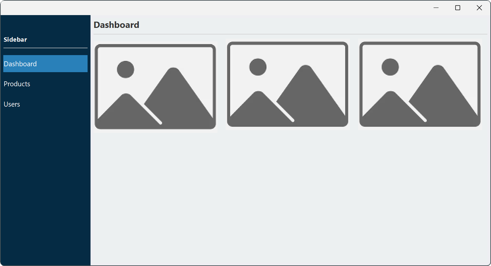

# Sidebar para Java Swing


Sidebar en Java Swing que permite gestionar la navegación de una aplicación, cambiando dinámicamente entre paneles y resaltando el elemento activo mediante `JLabel` o `JButton` para mejorar la experiencia del usuario y la usabilidad de la interfaz.  
 

  

*Vista del sidebar en la aplicación.*   

## Características

- Implementación de un sidebar con `JLabel` y `JButton`.
- Cambio dinámico de color para indicar el elemento activo.

## Instalación

### Opción 1: Clonar el repositorio

```bash
git clone https://github.com/raufjavedev/sidebar-swing.git
```

### Opción 2: Copiar la clase `Sidebar.java`

1. Crear una nueva clase en su proyecto llamada `Sidebar.java`.
2. Copiar y pegar el código de la clase.
3. Importar `Sidebar` en la clase principal o `JFrame` que maneje el sidebar.

## Uso

### 1. Crear una lista de componentes

Definir los `JLabel` o `JButton` que se utilizarán en el sidebar.

#### Para `JLabel`:

```java
// Crear lista de JLabels
List<JLabel> labels = Arrays.asList(lblDashboard, lblProduct, lblUser);
```

#### Para `JButton`:

```java
// Crear lista de JButtons
List<JButton> buttons = Arrays.asList(btnDashboard, btnProduct, btnUser);
```
> [!IMPORTANT] 
> Incluir en la lista todos los `JLabel` o `JButton` que formen parte del sidebar.  

### 2. Crear el manejador de color

Definir los colores activo y por defecto:

```java
// Crear el manejador de colores con colores activos y por defecto
Sidebar colorHandler = new Sidebar(new Color(41, 128, 185), new Color(5, 43, 68));
```

### 3. Establecer el color inicial

```java
// Establecer el primer elemento como activo por defecto y abrir el panel correspondiente
colorHandler.setActiveLabel(lblDashboard, labels);
openJPanel(new Dashboard());
```

### 4. Agregar eventos

> [!IMPORTANT] 
> Se deben agregar eventos a cada elemento del sidebar para manejar la selección y el cambio de panel.

#### Para `JLabel`:

```java
lblDashboard.addMouseListener(new MouseAdapter() {
    @Override
    public void mouseClicked(java.awt.event.MouseEvent e) {
        // Cambia el color del label activo y abre el panel correspondiente
        colorHandler.setActiveLabel(lblDashboard, labels); // Establece lblDashboard como activo y aplica el color por defecto al resto de los labels.
        openJPanel(new Dashboard());
    }
});
```

#### Para `JButton`:

```java
btnDashboard.addActionListener(e -> {
    // Cambia el color del botón activo y abre el panel correspondiente
    colorHandler.setActiveButton(btnDashboard, buttons); // Establece btnDashboard como activo y aplica el color por defecto al resto de los botones (buttons).
    openJPanel(new Dashboard());
});
```

### 5. Manejo de `JPanel`

Para cambiar los paneles dentro del `JFrame` principal, se recomienda el siguiente método:

```java
public void openJPanel(JPanel panel) { 
    // Remueve todos los paneles actuales del contenedor principal
    jpContainer.removeAll();
    // Agrega el nuevo panel en el centro del contenedor
    jpContainer.add(panel, BorderLayout.CENTER); 
    // Refresca la interfaz para aplicar los cambios
    jpContainer.revalidate();
    jpContainer.repaint();
}
```
> [!NOTE]
>El método puede ser público o privado según la forma en que se gestione en la aplicación.  

`jpContainer` es el `JPanel` padre dentro del `JFrame` principal que gestiona la visualización de los `JPanel` secundarios. Su diseño debe estar configurado con `BorderLayout`, permitiendo que el panel correspondiente se cargue dinámicamente cuando se presiona un elemento del sidebar.


## Consideraciones

- Se recomienda usar **[FlatLaf](https://github.com/JFormDesigner/FlatLaf)** para mejorar la apariencia visual.
- El `JFrame` principal debe incluir un `JPanel` configurado con `BorderLayout`.  

## Licencia 

Este proyecto está bajo la licencia **MIT**. Consulta el archivo [`LICENSE`](LICENSE) para más detalles.
